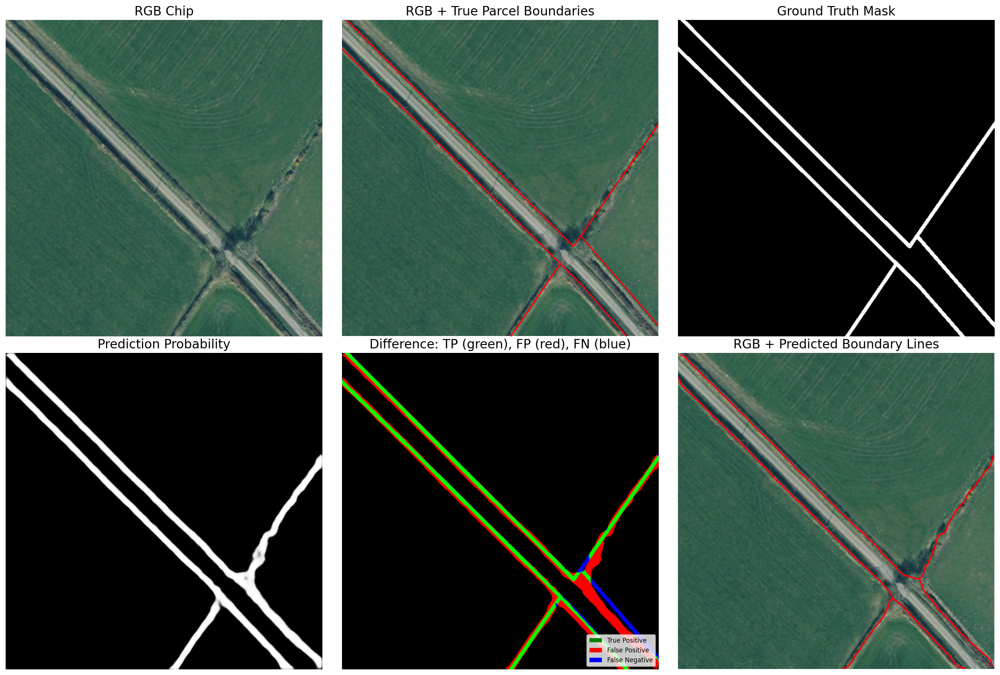

# Boundary Segment
Predict land parcel boundaries using high resolution aerial photography and segmentation models such as [U-Net](https://arxiv.org/abs/1505.04597) and [Unet++](https://arxiv.org/abs/1807.10165).

# Setup
This process uses open source geospatial packages and PyTorch. Use of a GPU is recommended for training the models and making predictions. 

## Using Docker
Can optionally use the Docker setup I used in developing of this process. This is found under `/.devcontainer`. 

1. First cd to the repo and build the Docker image:
```bash
docker build -t boundary-segment -f .devcontainer/Dockerfile .
```

2. Run the container (mounting current directory to /app):
```bash
docker run --gpus all -it --rm -v $(pwd):/app boundary-segment

# Windows Powershell use this instead:
docker run --gpus all -it --rm -v "${PWD}":/app boundary-segment
```

If you use VS Code and Docker a devcontainer.json is included in under `/.devcontainer`. In this case you do not need to run the docker commands above, just open the repository in VS Code and under Command Palette use Devcontainer: Reopen in container.

## Without Docker
The `requirements.txt` can be used to install the packages needed, if not on Windows.

**For Windows users** as the process uses GDAL, you will probably find it easier to install the geospatial packages with Conda. 

### Instructions for Windows users (non-Docker)
1. With Conda available on your machine, create a conda environment and install the geospatial packages with a conda install command.

```bash
# create conda geo_env and install gdal etc
conda create -n geo_env python=3.12 pip gdal rasterio geopandas shapely -c conda-forge
# activate the new env
conda activate geo_env
```

2. With the `geo_env` environment active, pip install the remaining packages into the conda python home.
```bash
# install torch
python -m pip install torch torchvision --index-url https://download.pytorch.org/whl/cu118

# install other packages, e.g. rschip not on conda-forge
python -m pip install rschip segmentation-models-pytorch albumentations opencv-python-headless pytest black flake8 tqdm scikit-learn scikit-image matplotlib
```

# Training a segmentation model
After you `git clone` this repository, you should acquire some images and put them into the repository `inputs/` directory.  

This process has been developed using the aerial photography available from [Bluesky under the APGB](https://apgb.blueskymapshop.com). 

Scripts are available in this repository to complete all processing steps required, starting from the JPEG files you can request to download from Bluesky under the APGB.  

The code in this repository is a series of Python scripts with input arguments specified in the terminal. For all the scripts described below, you can get help by running the following in the terminal:
```bash
python path/name_of_script.py --help
```

## 1. Assign CRS and convert jpegs to geotiffs
The APGB images do not have a CRS and arrive in jpeg format.
```bash
python utils/assign_crs_to_images.py --img-dir "inputs/images/gretna/12.5cm Aerial Photo"
```

## 2. Create a GDAL vrt from the images
A GDAL vrt is an XML reference file. It is much quicker to build and takes less disk space than building a mosaic image.
```bash
python utils/create_vrt.py --img-dir "inputs/images/gretna/12.5cm Aerial Photo/tiff_with_crs/downscaled_025"
```

## 3. Create chip images from vrt
Uses the [rs-chip](https://github.com/tomwilsonsco/rs-chip) package.  
Progress bar takes a while to move from 0 as only moves once whole batch complete. Look at the output dir that chip files are being created if unsure.

```bash
python utils/chip_image.py --vrt "inputs/images/gretna/12.5cm Aerial Photo/tiff_with_crs/downscaled_025/apgb_imgs.vrt" --chip-size 512 --chip-offset 384 --resampling-factor 0.5 --create-index-layer
```

The `--resampling-factor 0.5` is used in this example to downscale the chips at the point of creation from 0.125 m per pixel in the source imagery to 0.25 m, requiring 4 times fewer chips to cover a given extent. The output chip size (512 in this example) accounts for the downscaling and output chips will be 0.25 m per pixel and 512 by 512 pixels. 

## 4. Create masks from land parcel lines
This will create an equivalent binary mask tif (1 for lines 0 for background) for each input image.
```bash
python unet/create_masks.py --chip-dir "inputs/images/gretna/12.5cm Aerial Photo/tiff_with_crs/downscaled_025/chips" --shapefile inputs/gretna_parcels.gpkg
```
## 5. Split the chip images and masks into train, validation, test sets
The process using `rschip.DatasetSplitter()` will check for and not copy image-mask pairs that are all background (0 class only).

```bash
python unet/split_dataset_train_test.py --image-dir "inputs/images/gretna/12.5cm Aerial Photo/tiff_with_crs/downscaled_025/chips" --mask-dir "inputs/images/gretna/12.5cm Aerial Photo/tiff_with_crs/downscaled_025/chips/masks" --output-dir inputs/images/gretna
```

## 6. Train model
Many of these args are the default values but included here for info.
```bash
# to see help on script arguments
python unet/train.py --help

# running the training
python unet/train.py --dataset-dir inputs/images/gretna/dataset --arch unetplusplus --encoder efficientnet-b3 --epochs 30 --batch-size 8 --lr 0.0001 --desc test-025m
```

## 7. Evaluate model
We use the evaluate.py to use trained model to predict from each test set image and then report summary stats on intersect over union (IoU) and dice score.

```bash
python unet/evaluate.py --dataset-dir inputs/images/gretna/dataset --model models/example_test-025m_unetplusplus.pth
```
 **Note:**: Although given above, we do not necessarily need to specify the model .pth file as by default it will take the most recent based on date time saved in the .pth file name. The `--model` argument is needed if not testing the most recently available.

## 8. Predict with model
Once a trained model is achieving test set prediction performance you are happy with, you can predict for all chipped images across a continuous extent and produce a geopackage output of the boundary line predictions.

This process takes a while to complete on large extents.

```bash
python unet/predict.py --input-dir "inputs/images/gretna/12.5cm Aerial Photo/tiff_with_crs/downscaled_025/chips"
```

As with the evaluate script, predict will use the latest trained model in `models/` unless the `--model` argument is used to specify a different one.

## 9. Plot some prediction examples
We can create plots as shown below for predictions on the test set of chips. Vary the number of samples and seed values to get different number and selection of plots.

```bash
python unet/example_plots.py --dataset-dir inputs/images/gretna/dataset  --parcels-gpkg "inputs/gretna_parcels.gpkg" --num-samples 5 --seed 999
```



## 10. Run line evaluation
The models's aim is to predict true, visible boundary lines, but in the subsequent comparison work, the prediction line is allowed to be within a buffer of the mapped parcel line. 

This script accounts for this by specifying a buffer distance (metres) and then calculates lengths of true positive (TP), false positive (FP), false negative (FN) prediction line segments. These are written into a new output line geometry layer.

```bash
python unet/line_evaluate.py --pred-gpkg outputs/predictions/20260320_092233_20260319_215151_rgb025_unetplusplus_boundaries_50epoch.gpkg --parcels inputs/gretna_parcels.gpkg --buffer-dist 3
```

## 11. Stats per chip
It is useful to see statistics per chip on lengths of prediction TP, FP, FN and these can be used to calculate precision and recall and then F1 scores per chip. 

This can be used to rank chips and review ones with a low F1 to discern chips with non-visible boundary lines (not benefitting training), from difficult to predict lines but that could be predicted by refining model training.

The `unet/chip_metrics.py` process adds these stats per chip to a copy of the index layer. Make sure to have used the `--create-index-layer` option of `utils/chip_image.py`.

```bash
python unet/chip_metrics.py --line-comparison outputs/predictions/20260320_092233_20260319_215151_rgb025_unetplusplus_boundaries_50epoch_result_compare.gpkg --mask-dir "inputs/images/gretna/12.5cm Aerial Photo/tiff_with_crs/chips/masks" --chips-index "inputs/images/gretna/12.5cm Aerial Photo/tiff_with_crs/chips/chips_index.gpkg" --dataset-dir inputs/images/gretna/dataset
```
 

# Running full process
A shell script is included that runs each stage described above for testing. This could be edited for production runs too. In a terminal after `cd` to the repository run:

```bash
bash run_test_pipeline.sh
```
An equivalent CMD is available for Windows users. On Windows you may need to enable your Conda env first see [instructions for windows users](#instructions-for-windows-users-non-docker) and then run:

```powershell
run_test_pipeline.cmd
```