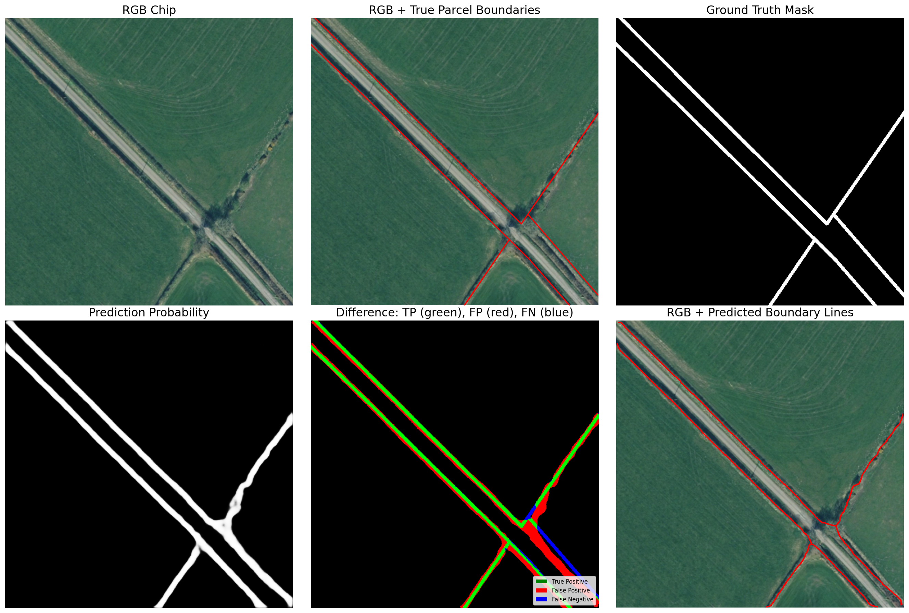

# Boundary Segment
Predict land parcel boundaries using high resolution aerial photography and segmentation models such as [U-Net](https://arxiv.org/abs/1505.04597) and [Unet++](https://arxiv.org/abs/1807.10165).

## Process overview



| Step | Script | Key input | Key output |
|------|--------|-----------|------------|
| 1 | `utils/assign_crs_to_images.py` | JPEG images | GeoTIFFs with CRS |
| 2 | `utils/create_vrt.py` | GeoTIFFs | `.vrt` mosaic |
| 3 | `utils/chip_image.py` | `.vrt` | Chip `.tif` files + `chips_index.gpkg` |
| 4 | `unet/create_masks.py` | Chip TIFFs + parcels | Binary mask TIFFs |
| 5 | `unet/split_dataset_train_test.py` | Chips + masks | `dataset/` train/val/test split |
| 6 | `unet/train.py` | `dataset/` | Trained model `.pth` |
| 7 | `unet/evaluate.py` | `dataset/test/` + model | IoU / Dice metrics |
| 8 | `unet/predict.py` | Chip TIFFs + model | Boundary lines `.gpkg` |
| 9 | `unet/example_plots.py` | `dataset/test/` + model + parcels | 6-panel PNG plots |
| 10 | `unet/line_evaluate.py` | Predictions `.gpkg` + parcels | TP/FP/FN lines `.gpkg` |
| 11 | `unet/chip_metrics.py` | TP/FP/FN lines + chips index | `chips_index_metrics.gpkg` |
| 12 | `unet/filter_training_chips.py` | `chips_index_metrics.gpkg` | Updated `chips_ignore.csv` |
| → | Re-run Step 5 | Updated `chips_ignore.csv` | Cleaner dataset for retraining |

# Setup
This process uses open source geospatial packages and PyTorch. Use of a GPU is recommended for training the models and making predictions. 

## Using Docker
You can optionally use the Docker setup used during development of this process. This is found under `/.devcontainer`. 

1. First cd to the repo and build the Docker image:
```bash
docker build -t boundary-segment -f .devcontainer/Dockerfile .
```

2. Run the container (mounting current directory to /app):
```bash
docker run --gpus all -it --rm -v $(pwd):/app boundary-segment

# Windows Powershell use this instead:
docker run --gpus all -it --rm -v "${PWD}":/app boundary-segment
```

If you use VS Code and Docker a devcontainer.json is included in under `/.devcontainer`. In this case you do not need to run the docker commands above, just open the repository in VS Code and under Command Palette use Devcontainer: Reopen in container.

## Without Docker
The `requirements.txt` can be used to install the packages needed, if not on Windows.

**For Windows users** as the process uses GDAL, you will probably find it easier to install the geospatial packages with Conda. 

### Instructions for Windows users (non-Docker)
1. With Conda available on your machine, create a conda environment and install the geospatial packages with a conda install command.

```bash
# create conda geo_env and install gdal etc
conda create -n geo_env python=3.12 pip gdal rasterio geopandas shapely -c conda-forge
# activate the new env
conda activate geo_env
```

2. With the `geo_env` environment active, pip install the remaining packages into the conda python home.
```bash
# install torch
python -m pip install torch torchvision --index-url https://download.pytorch.org/whl/cu118

# install other packages, e.g. rschip not on conda-forge
python -m pip install rschip segmentation-models-pytorch albumentations opencv-python-headless pytest black flake8 tqdm scikit-learn scikit-image matplotlib
```

# Training a segmentation model
After you `git clone` this repository, you should acquire some images and put them into the repository `inputs/` directory.  

This process has been developed using the aerial photography available from [Bluesky under the APGB](https://apgb.blueskymapshop.com). 

Scripts are available in this repository to complete all processing steps required, starting from the JPEG files you can request to download from Bluesky under the APGB.  

The code in this repository is a series of Python scripts with input arguments specified in the terminal. For all the scripts described below, you can get help by running the following in the terminal:
```bash
python path/name_of_script.py --help
```

## Expected input directory structure

```
inputs/
├── images/
│   └── <area_name>/
│       └── 12.5cm Aerial Photo/   ← APGB JPEG files go here
└── <area_name>_parcels.gpkg       ← land parcel polygons
```

After running Steps 1–3 the `inputs/images/` tree will be populated with GeoTIFFs, a VRT, and chip files automatically.

## 1. Assign CRS and convert jpegs to geotiffs
The APGB images do not have a CRS and arrive in jpeg format.
```bash
python utils/assign_crs_to_images.py --img-dir "inputs/images/gretna/12.5cm Aerial Photo"
```

## 2. Create a GDAL vrt from the images
A GDAL vrt is an XML reference file. It is much quicker to build and takes less disk space than building a mosaic image.
```bash
python utils/create_vrt.py --img-dir "inputs/images/gretna/12.5cm Aerial Photo/tiff_with_crs"
```

## 3. Create chip images from vrt
Uses the [rs-chip](https://github.com/tomwilsonsco/rs-chip) package.  
The progress bar may take a while to update from 0%, as it only advances once a full batch is complete. If unsure whether the script is running, check that .tif files are appearing in the output directory.

```bash
python utils/chip_image.py --vrt "inputs/images/gretna/12.5cm Aerial Photo/tiff_with_crs/apgb_imgs.vrt" --chip-size 512 --chip-offset 384 --resampling-factor 0.5
```

The `--resampling-factor 0.5` is used in this example to downscale the chips at the point of creation from 0.125 m per pixel in the source imagery to 0.25 m, requiring 4 times fewer chips to cover a given extent. The output chip size (512 in this example) accounts for the downscaling and output chips will be 0.25 m per pixel and 512 by 512 pixels. 

Chips that are not entirely within the extent of the VRT are recorded in a chips_ignore.csv in the chips directory. This is used to exclude them from inclusion in training dataset. This csv is added to during [5. Split images and masks](#5-create-dataset-for-train-validation-test) and [12. Filtering Chips](#12-filter-training-chips).

## 4. Create masks from land parcel lines
This will create an equivalent binary mask tif (1 for lines 0 for background) for each input image.
```bash
python unet/create_masks.py --chip-dir "inputs/images/gretna/12.5cm Aerial Photo/tiff_with_crs/chips" --parcels inputs/gretna_parcels.gpkg
```
## 5. Create dataset for train, validation, test
Background-only chips (where the mask contains no boundary pixels) are automatically excluded from the dataset and recorded in `chips_ignore.csv` in the chips directory. This file accumulates exclusions across multiple steps — see [12. Filter Training Chips](#12-filter-training-chips).

```bash
python unet/split_dataset_train_test.py --chip-dir "inputs/images/gretna/12.5cm Aerial Photo/tiff_with_crs/chips" --mask-dir "inputs/images/gretna/12.5cm Aerial Photo/tiff_with_crs/chips/masks" --output-dir inputs/images/gretna
```

## 6. Train model
Many of these args are the default values but included here for info.
```bash
# to see help on script arguments
python unet/train.py --help

# running the training
python unet/train.py --dataset-dir inputs/images/gretna/dataset --arch unetplusplus --encoder efficientnet-b3 --loss-method bce_dice --epochs 30 --batch-size 8 --lr 0.0001 --desc test-025m
```

## 7. Evaluate model
Use `evaluate.py` to run the trained model on each test set image and report summary statistics: Intersection over Union (IoU) and Dice score.

```bash
python unet/evaluate.py --dataset-dir inputs/images/gretna/dataset --model models/example_test-025m_unetplusplus.pth
```
> **Note:** By default the most recent model in `models/` is used, selected by the timestamp in the filename. Only specify `--model` if you want to evaluate an older model.

## 8. Predict with model
Once a trained model is achieving test set prediction performance you are happy with, you can predict for all chipped images across a continuous extent and produce a geopackage output of the boundary line predictions.

This process takes a while to complete on large extents.

```bash
python unet/predict.py --chip-dir "inputs/images/gretna/12.5cm Aerial Photo/tiff_with_crs/chips"
```

As with the evaluate script, predict will use the latest trained model in `models/` unless the `--model` argument is used to specify a different one.

## 9. Plot some prediction examples
We can create plots as shown below for predictions on the test set of chips. Vary the number of samples and seed values to get different number and selection of plots.

```bash
python unet/example_plots.py --dataset-dir inputs/images/gretna/dataset  --parcels "inputs/gretna_parcels.gpkg" --num-samples 5 --seed 999
```



## 10. Run line evaluation
The model's aim is to predict visible boundary lines. In this evaluation a predicted line segment is counted as a True Positive (TP) if it falls within a specified buffer distance of the mapped ground truth line.

This script accounts for this by specifying a buffer distance (metres) and then calculates lengths of true positive (TP), false positive (FP), false negative (FN) prediction line segments. These are written into a new output line geometry layer.

```bash
python unet/line_evaluate.py --pred-gpkg outputs/predictions/20260320_092233_20260319_215151_rgb025_unetplusplus_boundaries_50epoch.gpkg --parcels inputs/gretna_parcels.gpkg --chip-dir "inputs/images/gretna/12.5cm Aerial Photo/tiff_with_crs/chips" --buffer-dist 3
```

## 11. Stats per chip
It is useful to see statistics per chip on lengths of prediction TP, FP, FN and these can be used to calculate precision and recall and then F1 scores per chip. 

This can be used to rank chips and review ones with a low F1 to discern chips with non-visible boundary lines (not benefitting training), from difficult to predict lines but that could be predicted by refining model training.

The `unet/chip_metrics.py` process adds these stats per chip to a copy of the index layer.

```bash
python unet/chip_metrics.py --line-comparison outputs/predictions/20260320_092233_20260319_215151_rgb025_unetplusplus_boundaries_50epoch_result_compare.gpkg --mask-dir "inputs/images/gretna/12.5cm Aerial Photo/tiff_with_crs/chips/masks" --chips-index "inputs/images/gretna/12.5cm Aerial Photo/tiff_with_crs/chips/chips_index.gpkg" --dataset-dir inputs/images/gretna/dataset --output-gpkg "inputs/images/gretna/12.5cm Aerial Photo/tiff_with_crs/chips/chips_index_metrics.gpkg"
```

## 12. Filter training chips
To produce a good quality training dataset it can be useful to remove non-useful chips by making an initial prediction using a base model or early stopped model. The types of chips to remove:
1. "Corner clippers": Chips where a training data boundary line just clips the corner of the chip, otherwise no boundary lines seen in the chip.
2. "Invisible boundary": Chips with low recall. This could be because the boundary is not visible on the image.
3. "Extra boundary": Chips with low precision. This could be because the training data lines are out of date and new boundaries are seen on the image.

`chips_ignore.csv` records all chips to exclude: those that fall outside the image extent (added in Step 3), background-only chips (added in Step 5), and low-quality chips identified here. Re-running Step 5 after this step will build a cleaner dataset that excludes all of these chips.

```bash
python unet/filter_training_chips.py --input-gpkg "inputs/images/gretna/12.5cm Aerial Photo/tiff_with_crs/chips/chips_index_metrics.gpkg" --chip-dir "inputs/images/gretna/12.5cm Aerial Photo/tiff_with_crs/chips" --min-training-length 30 --recall-min 0.5 --min-precision 0.5
```


## Utility Scripts

The following scripts are part of the repository but are not part of the main pipeline above.

| Script | What it does |
|---|---|
| `utils/merge_training_datasets.py` | Merges two existing train/val/test dataset directories into one, prefixing filenames to avoid collisions. Useful when combining data from multiple geographic areas. |
| `unet/calculate_mask_proportion.py` | Samples a percentage of mask chips and reports the mean proportion of boundary pixels. Use the result to determine a sensible `--pos-weight` for `train.py`. |
| `unet/delete_dataset_chips.py` | Deletes chips listed in `chips_ignore.csv` from an existing dataset directory. An alternative to re-running `split_dataset_train_test.py` after filtering. |

# Running full process
A shell script is included that runs each stage described above for testing. This could be edited for production runs too. In a terminal after `cd` to the repository run:

```bash
bash run_test_pipeline.sh
```
An equivalent CMD is available for Windows users. On Windows you may need to enable your Conda env first see [instructions for windows users](#instructions-for-windows-users-non-docker) and then run:

```powershell
run_test_pipeline.cmd
```